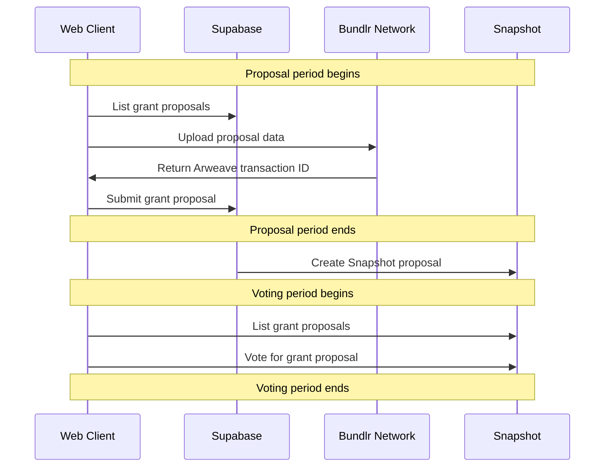

# ENS Small Grants
This is a semi-autonomous grant application designed to help ENS DAO distribute small grants to a wider range of projects at a regular rate.

- [ENS Public Goods Working Group grant proposal](https://discuss.ens.domains/t/pg-wg-proposal-ens-small-grants/12843)
- [Metaphor Product Spec](https://metaphorxyz.notion.site/ENS-Small-Grants-3d75af5ba7a64954b81eed23191fbfd4)

## Setup

Running the project:

1. Install [Docker](https://www.docker.com/products/docker-desktop/)
2. Install [supabase cli](https://github.com/supabase/cli#install-the-cli)
```
> yarn install
> yarn dev
```

and in another tab:

```
> supabase functions serve rpc
```

## Architecture
For the initial implementation, the focus is on speed of deployment, while retaining independent vote audit-ability.

- During the Proposal Stage, proposal text is stored in ARweave (via Bundlr) and indexed by a web2 Cloudflare Worker
- Once Proposal Stage is complete, a Cloudflare Worker function will be used to generate the Snapshot Proposal, where each Grant Proposal is a "choice" in a single-choice vote, including the arweave transaction ID
- Once on Voting Stage, the app uses Snapshot as the source of truth and no longer relies on the Cloudflare Worker



## TODO

MVP
- [x] Function to upload proposal data and create Snapshot proposal
- [x] Make everything react correctly to proposal/voting start/end dates
- [ ] UI to vote on active proposal round
- [x] Add RLS to supabase
- [ ] Make sure timeline is enforced in functions

Feature complete v0
- [ ] UI to create proposal round
- [ ] Make design style line up properly with mockups


## License
This project is licensed under both MIT and Apache 2.0
