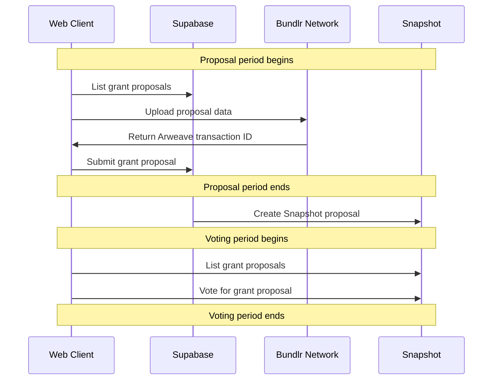

# ENS Small Grants
This is a semi-autonomous grant application designed to help ENS DAO distribute small grants to a wider range of projects at a regular rate.

- [ENS Public Goods Working Group grant proposal](https://discuss.ens.domains/t/pg-wg-proposal-ens-small-grants/12843)
- [Metaphor Product Spec](https://metaphorxyz.notion.site/ENS-Small-Grants-3d75af5ba7a64954b81eed23191fbfd4)

## Setup

Running the project:

1. Install [Docker](https://www.docker.com/products/docker-desktop/)
2. Install [supabase cli](https://github.com/supabase/cli#install-the-cli)
```
> yarn install
> yarn dev
```

and in another tab:

```
> supabase functions serve rpc
```

## Creating a Round

1. Go to [supabase](https://supabase.com) Studio UI
2. Go to Tables -> `rounds`
3. Create a new row in the `rounds` table
4. Fill out the information needed, using integers in wei for token amounts and hex addresses for addresses (use 0x00 for `allocation_token_address` for ETH)
5. Use the ENS name for the snapshot space as the `snapshot_space_id` (eg. small-grants.eth)
6. Save the new row

## Setting up Snapshot

When the proposal period is done, you need to setup the Snapshot Space for voting. This can be done with one click in the UI by going to https://ensgrants.xyz/create_snapshot (or whatever domain you have the app deployed to) and clicking the button on that page. It will ask you to sign a message and that should create the compatible Snapshot space with all the proposals as options. (Note: you must be an admin, or otherwise able to create proposals on the snapshot space specified in `snapshot_space_id` during setup of the round)

## Architecture
For the initial implementation, the focus is on speed of deployment, while retaining independent vote audit-ability.

- During the Proposal Stage, proposal text is stored in ARweave (via Bundlr) and indexed by a web2 Cloudflare Worker
- Once Proposal Stage is complete, a Cloudflare Worker function will be used to generate the Snapshot Proposal, where each Grant Proposal is a "choice" in a single-choice vote, including the arweave transaction ID
- Once on Voting Stage, the app uses Snapshot as the source of truth and no longer relies on the Cloudflare Worker



## TODO

MVP
- [x] Function to upload proposal data and create Snapshot proposal
- [x] Make everything react correctly to proposal/voting start/end dates
- [x] UI to vote on active proposal round
- [x] Add RLS to supabase
- [x] Make sure timeline is enforced in functions

Feature complete v0
- [x] UI to create proposal round
- [x] Make design style line up properly with mockups


## License
This project is licensed under both MIT and Apache 2.0
